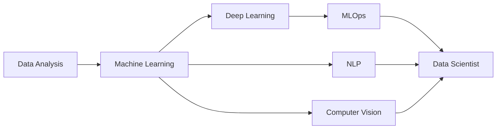

  
---

  
  
  

  

 

---
## 💼 Technical Skills

 

## 🌱 Learning Roadmap

---
**Current Focus:**
- ✅ Advanced Python & Statistics
- 🔄 Machine Learning Fundamentals
- 🔄 Deep Learning with TensorFlow/PyTorch
- 🔄 Cloud Platforms (AWS/Azure)
- 📅 MLOps & Production Deployment
- 📅 Advanced NLP & Transformers

---

## 💡 Data Science Principles I Follow

> *"In Allah we trust, all others must bring data."* —

